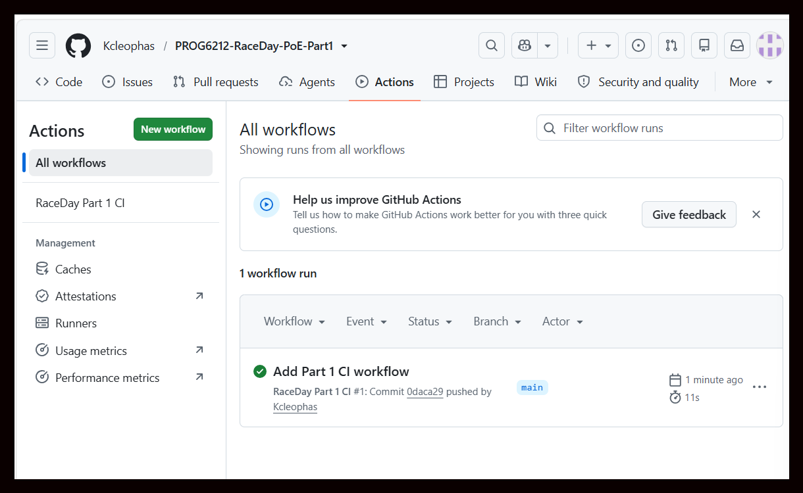

# RaceDay Event Management System

## Project Description

RaceDay is a web-based event management system for South African
road running, walking, and cycling events.

For Part 1, I focused on planning the system before application
development begins. I created the database design, planned the
future API endpoints, created the SQL Server database script,
and set up GitHub Actions to validate the required files.

## User Roles

### Organiser

Organisers manage the events they create. They can create, edit,
and delete events, manage event categories, view event enrolments,
and capture participant race results.

### Participant

Participants can create an account and log in, browse available
events, enter an event by selecting a category, view their own
enrolments, and view their race results and performance history.

## Part 1 Deliverables

| Document | Description |
|---|---|
| [RaceDay ERD](docs/RaceDay_ERD.pdf) | Shows the database entities, attributes, primary keys, foreign keys, relationships, and cardinality. |
| [RaceDay API Endpoint Plan](docs/RaceDay_API_Endpoint_Plan.pdf) | Plans the REST API endpoints, including HTTP methods, routes, descriptions, roles, request bodies, and expected responses. |
| [RaceDay Database SQL](docs/RaceDay_Database.sql) | Creates the RaceDay SQL Server database, tables, keys, constraints, and realistic sample data. |

## Repository Structure

```text
PROG6212-RaceDay-PoE-Part1
├── README.md
├── docs
│   ├── RaceDay_ERD.pdf
│   ├── RaceDay_API_Endpoint_Plan.pdf
│   └── RaceDay_Database.sql
└── .github
    └── workflows
        └── part1-ci.yml
```

## Database Setup

The database script is written for Microsoft SQL Server and can be executed in SQL Server Management Studio (SSMS).
## Database Setup

1. Open SQL Server Management Studio.
2. Open `docs/RaceDay_Database.sql`.
3. Connect to the SQL Server instance.
4. Run the complete script from beginning to end.
5. Confirm that `RaceDayDB` and all seven tables are created.
6. Check the sample data using the verification queries.

The script creates the following entities:

- Users
- OrganiserProfiles
- ParticipantProfiles
- Events
- Categories
- Enrolments
- Results

The sample data includes organisers, participants, events, categories, enrolments, and race results so that the relationships can be tested.

## CI/CD

GitHub Actions is used to validate the Part 1 repository structure. The workflow checks that the required `docs` folder, README file, ERD, API Endpoint Plan, and SQL database script are present.

### Successful GitHub Actions Build



The workflow completed successfully on the `main` branch.


**YouTube Link:** 
## Part 1 Video

My Part 1 video has been uploaded to YouTube as an Unlisted video.

[Watch my Part 1 video](https://youtu.be/HztT_DQQDrA)

## Part 1 Notes

Part 1 is a planning and database submission. The API and MVC application are not implemented in this part. The ERD, API Endpoint Plan, and SQL database script are designed to support the development work in later parts of the RaceDay project.
